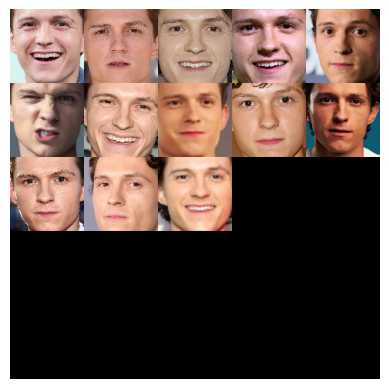

# Face clustering

This Python script is designed to cluster similar faces together using the DBSCAN algorithm. The faces are first identified using a face recognition script and then encoded into 128-dimensional arrays using HOG. Dimensionality reduction is performed on the encodings using PCA, and then the reduced encodings are clustered together using DBSCAN. Finally, the script displays the faces in the same clusters. The cluaters are also plotted.

## Prerequisites

Before running the script, make sure you have the following installed:

    dlib==19.24.99
    face-recognition==1.3.0
    imutils==0.5.4
    matplotlib==3.7.2
    numpy==1.25.1
    opencv-python==4.8.0.74
    scikit-learn==1.3.0

You can install dlib and the other required packages using pip:

```
pip install -r requirements.txt
```

## How to Use

1. Clone the repository to your local machine:

    ```
    git clone https://github.com/iamadityavishnu/face-clustering.git
    ```

2. Navigate to theproject directory:

    ```
    cd face-clustering
    ```

3. Place your dataset of images in the `dataset` folder. The images should contain faces that you want to cluster. You can have images with multiple faces.

4. Run the script using the following command:

    ```
    python encode_faces.py --dataset dataset --encodings <name_your_pickle_file> --detection-method hog
    ```

    The `--dataset` argument takes path to input directory of images. Give the name of the pickle file you want to create in the `--encodings` argument (for eg. `encodings.pickle`). The `--detection-method` argument, by default uses CNN for face detection. If you have a GPU enabled device, CNN should give better accuracy than HOG. If you do not have a GPU enabled device, using HOG algorithm would be better as it performs quickly when compared to CNN on CPU only device.

    To install GPU enabled `dlib` using conda, please follow [this](https://gist.github.com/nguyenhoan1988/ed92d58054b985a1b45a521fcf8fa781) tutorial.

The script will perform the following steps:

_In the encode_faces.py file_

1. Face Detection: The script will use the face recognition library to detect faces in the images present in the "data" folder.

2. Face Encoding: The detected faces will be encoded into 128-dimensional arrays using Histogram of Oriented Gradients (HOG) algorithm. The encodings will be saved as a pickle file.

---

_In the notebook file_

3. Dimensionality Reduction: Principal Component Analysis (PCA) will be applied to reduce the dimensionality of the face encodings.

4. Clustering: The reduced encodings will be clustered together using the DBSCAN algorithm.

5. Display: The script will display the faces that belong to the same clusters. The outliers are the random people who appeared in group photos from the dataset.

6. Plot Clusters: The clusters will be plotted to visualize the groupings of similar faces.

## Example Output

Here's an example of what the outputs might look like:




## Contributing

If you want to contribute to this project, feel free to fork the repository and submit pull requests.

## References

-   https://pyimagesearch.com/2018/07/09/face-clustering-with-python/
-   https://machinelearningmastery.com/principal-component-analysis-for-visualization/
-   https://www.jcchouinard.com/pca-with-python/
-   https://www.analyticsvidhya.com/blog/2019/09/feature-engineering-images-introduction-hog-feature-descriptor/

🫰
